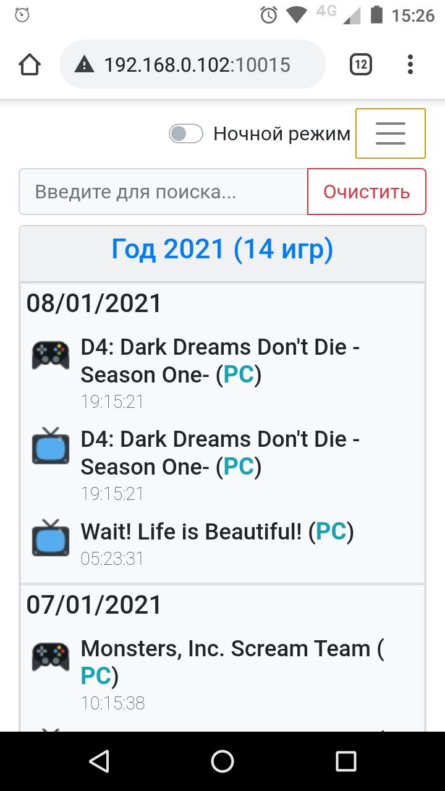
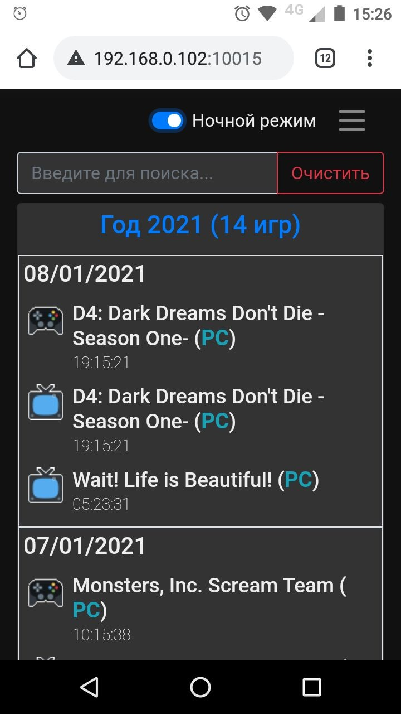

# lenta_of_played_games

## Screenshots:

|  |  | 
| --- | ---  |

### Known Issues:
 * https://github.com/sigmavirus24/github3.py/issues/1019

     * Fix: in `<python>\Lib\site-packages\github3\gists\history.py` replace:
         ```
         self.additions = self.change_status["additions"]
         self.deletions = self.change_status["deletions"]
         self.total = self.change_status["total"]
         ```
        on:
         ```
         self.additions = self.change_status.get("additions")
         self.deletions = self.change_status.get("deletions")
         self.total = self.change_status.get("total")
         ```